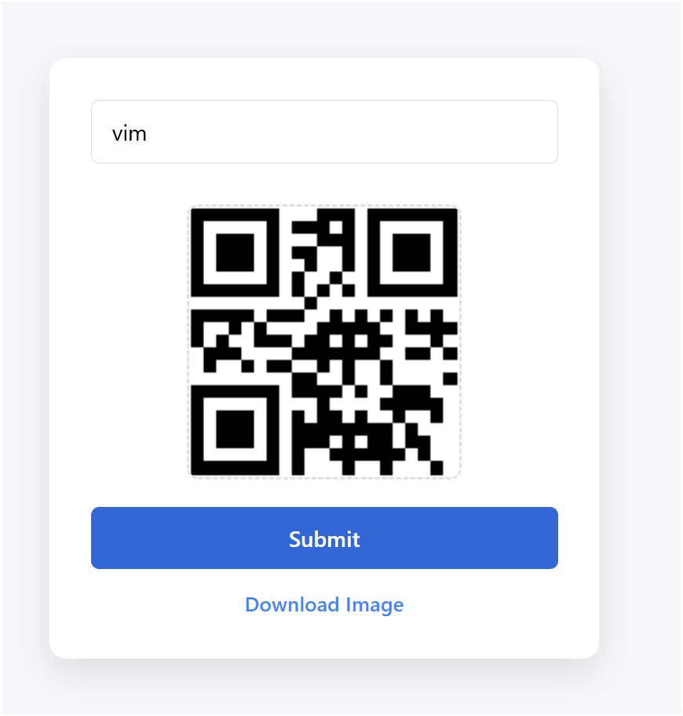
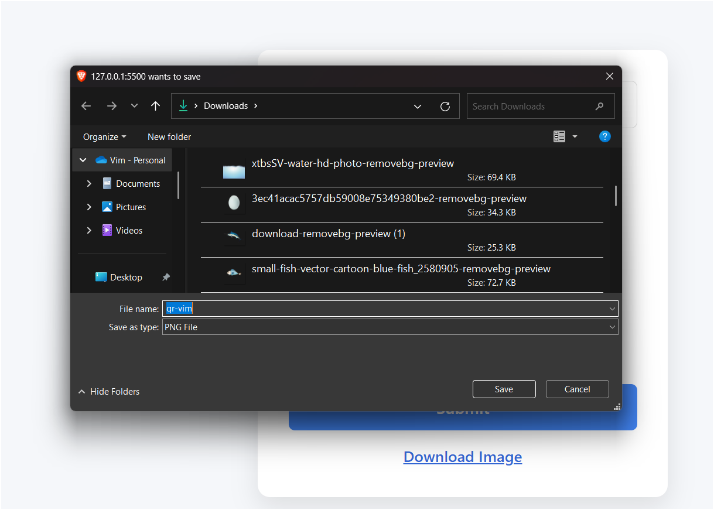

# Qr-Code Generator 
    <strong>Qr-code created by html css and js. It is easy to create. Hope so you guys' try it with your self. </strong>

Featutres :- 
1.Qr-Image   
2.Download-QrImage

## ScreenShots 

    
    

### Api Link : - 
    qr-code link = ("https://api.qrserver.com/v1/create-qr-code/?size=150x150&data=%22vim%22")

